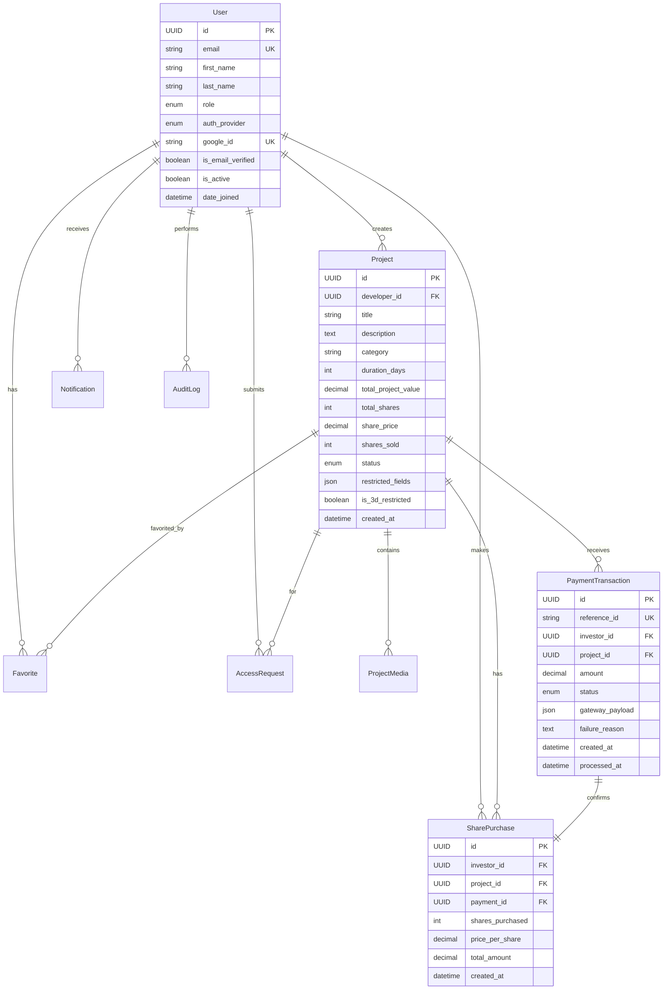

# Crowdfunding Trading Platform

> A modern, share-based crowdfunding platform with role-based access control, built with Django REST Framework and React.

[](https://www.python.org/)
[](https://www.djangoproject.com/)
[](https://www.django-rest-framework.org/)
[](https://www.postgresql.org/)
[](LICENSE)

---

## 📋 Table of Contents

- [Project Overview](#-project-overview)
- [System Architecture](#-system-architecture)
- [Database Schema & Models](#-database-schema--models)
- [Role-Based Access Control (RBAC)](#-role-based-access-control-rbac)
- [API Documentation](#-api-documentation)
- [Tech Stack](#-tech-stack)
- [Installation & Setup](#-installation--setup)
- [Project Structure](#-project-structure)
- [Features](#-features)
- [Security & Best Practices](#-security--best-practices)
- [Contributing](#-contributing)
- [License](#-license)

---

## 🎯 Project Overview

The **Crowdfunding Trading Platform** is an enterprise-grade web application that enables developers to raise funds for their projects by selling shares to investors. The platform implements a secure, transparent, and efficient crowdfunding ecosystem with comprehensive audit trails and real-time notifications.

### Key Highlights

- **Share-Based Funding Model**: Projects are divided into tradable shares with dynamic pricing
- **Multi-Role System**: Distinct workflows for Admins, Developers, and Investors
- **Atomic Transactions**: Guaranteed consistency in share allocation and payment processing
- **Real-Time Notifications**: Instant updates on project status, investments, and access requests
- **Comprehensive Audit Logging**: Complete traceability of all administrative actions
- **Restricted Content Access**: Granular control over sensitive project information and media
- **Email Verification**: Mandatory verification before critical operations
- **OAuth Integration**: Google OAuth support for seamless authentication

---

## 🏗️ System Architecture

### Backend Architecture (Django/DRF)

The backend follows a **modular monolithic architecture** with clear separation of concerns:

```
┌─────────────────────────────────────────────────────────────┐
│                     API Gateway (DRF)                        │
│                  JWT Authentication Layer                    │
└───────────────────────┬─────────────────────────────────────┘
                        │
        ┌───────────────┼───────────────┐
        │               │               │
┌───────▼──────┐ ┌─────▼──────┐ ┌─────▼──────┐
│   Users      │ │  Projects  │ │Investments │
│   Module     │ │   Module   │ │   Module   │
└──────────────┘ └────────────┘ └────────────┘
        │               │               │
┌───────▼──────┐ ┌─────▼──────┐ ┌─────▼──────┐
│Notifications │ │   Audit    │ │ Dashboard  │
│   Module     │ │   Module   │ │   Module   │
└──────────────┘ └────────────┘ └────────────┘
        │               │               │
┌───────▼──────┐ ┌─────▼──────┐
│  Favorites   │ │   Access   │
│   Module     │ │  Requests  │
└──────────────┘ └────────────┘
                        │
        ┌───────────────┴───────────────┐
        │                               │
┌───────▼──────┐              ┌─────────▼────────┐
│  PostgreSQL  │              │   Media Storage  │
│   Database   │              │   (File System)  │
└──────────────┘              └──────────────────┘
```

### Modular App Structure

Each Django app is self-contained with its own:
- **Models**: Database schema definitions
- **Serializers**: Data validation and transformation
- **Views**: Business logic and request handling
- **URLs**: Endpoint routing
- **Permissions**: Access control logic
- **Services**: Complex business operations (where applicable)

### Frontend Communication

The React/Vite frontend communicates with the backend via:
- **RESTful API**: JSON-based request/response
- **JWT Tokens**: Stateless authentication (Access + Refresh tokens)
- **CORS Configuration**: Secure cross-origin requests
- **API Versioning**: `/api/v1/` prefix for future compatibility

---

## 🗄️ Database Schema & Models

### Entity Relationship Overview



### Core Models

#### 1. **User Model** (`apps.users.models.User`)

Custom user model extending Django's `AbstractBaseUser` with role-based authentication.

**Key Fields:**
- `id` (UUID): Primary key
- `email` (EmailField): Unique identifier for authentication
- `role` (CharField): One of `ADMIN`, `DEVELOPER`, `INVESTOR`
- `auth_provider` (CharField): `LOCAL` or `GOOGLE`
- `google_id` (CharField): For OAuth integration
- `is_email_verified` (BooleanField): Email verification status

**Related Models:**
- `EmailVerificationToken`: Time-limited tokens for email verification
- `PasswordResetToken`: Secure password reset mechanism

**Indexes:**
- `email` (unique, indexed)
- `role + is_active` (composite index)
- `google_id` (unique, indexed)

---

#### 2. **Project Model** (`apps.projects.models.Project`)

Represents crowdfunding projects created by developers.

**Key Fields:**
- `id` (UUID): Primary key
- `developer` (ForeignKey → User): Project owner
- `title`, `description`, `category`: Project details
- `total_project_value` (Decimal): Total funding goal
- `total_shares` (PositiveInteger): Total shares available
- `share_price` (Decimal): Price per share
- `shares_sold` (PositiveInteger): Shares already sold
- `status` (CharField): `DRAFT`, `PENDING`, `APPROVED`, `REJECTED`, `NEEDS_CHANGES`, `ARCHIVED`
- `restricted_fields` (JSONField): Dynamic field-level access control
- `is_3d_restricted` (BooleanField): 3D model access restriction

**Computed Properties:**
- `remaining_shares`: `total_shares - shares_sold`
- `funding_percentage`: `(shares_sold / total_shares) * 100`

**Related Models:**
- `ProjectMedia`: Images and 3D models associated with projects

**Indexes:**
- `status + created_at` (composite, descending)
- `developer + status`
- `category + status`

---

#### 3. **Investment Models** (`apps.investments.models`)

##### **PaymentTransaction**
Tracks all payment attempts for audit trail and idempotency.

**Key Fields:**
- `reference_id` (CharField): Unique identifier for idempotent operations
- `investor`, `project` (ForeignKeys)
- `amount` (Decimal): Payment amount
- `status` (CharField): `INITIATED`, `SUCCESS`, `FAILED`
- `gateway_payload` (JSONField): Raw payment gateway response
- `failure_reason` (TextField): Error details if failed

##### **SharePurchase**
Created only after successful payment confirmation.

**Key Fields:**
- `investor`, `project` (ForeignKeys)
- `payment` (OneToOneField → PaymentTransaction): Links to payment
- `shares_purchased` (PositiveInteger): Number of shares bought
- `price_per_share` (Decimal): Price at time of purchase
- `total_amount` (Decimal): Total investment amount

**Constraints:**
- Atomic share allocation using database transactions
- Prevents overselling through `F()` expressions and row-level locking

---

#### 4. **Notification Model** (`apps.notifications.models.Notification`)

Real-time notification system for user updates.

**Key Fields:**
- `user` (ForeignKey → User): Recipient
- `type` (CharField): `PROJECT`, `INVESTMENT`, `ACCESS`, `SYSTEM`
- `title`, `message` (CharField/TextField): Notification content
- `metadata` (JSONField): Additional context data
- `is_read` (BooleanField): Read status

**Triggers:**
- Project approval/rejection
- Investment confirmations
- Access request decisions
- System announcements

---

#### 5. **AuditLog Model** (`apps.audit.models.AuditLog`)

Immutable audit trail for administrative actions.

**Key Fields:**
- `actor` (ForeignKey → User): Admin who performed action
- `action` (CharField): Description of action
- `entity_type` (CharField): Type of entity affected
- `entity_id` (UUID): ID of affected entity
- `metadata` (JSONField): Additional context

**Characteristics:**
- Never updated or deleted
- Admin-only access
- Complete traceability

---

#### 6. **Supporting Models**

- **Favorite** (`apps.favorites.models.Favorite`): Investor project bookmarks
- **AccessRequest** (`apps.access_requests.models.AccessRequest`): Requests for restricted content access
- **ProjectMedia** (`apps.projects.models.ProjectMedia`): Project images and 3D models

---

## 🔐 Role-Based Access Control (RBAC)

The platform implements a strict three-role hierarchy with distinct permissions:

### Role Definitions

| Role | Description | Primary Use Cases |
|------|-------------|-------------------|
| **Admin** | Platform administrators with full system access | Project approval, user management, audit logs, system configuration |
| **Developer** | Project creators seeking funding | Create/edit projects, upload media, view project analytics, respond to feedback |
| **Investor** | Users who fund projects by purchasing shares | Browse projects, invest in shares, manage portfolio, request restricted access |

### Permission Matrix

| Feature | Admin | Developer | Investor |
|---------|-------|-----------|----------|
| **User Management** |
| View all users | ✅ | ❌ | ❌ |
| Manage user roles | ✅ | ❌ | ❌ |
| **Project Management** |
| Create projects | ❌ | ✅ | ❌ |
| Edit own projects | ❌ | ✅ | ❌ |
| Submit for review | ❌ | ✅ | ❌ |
| Approve/Reject projects | ✅ | ❌ | ❌ |
| Request changes | ✅ | ❌ | ❌ |
| Browse approved projects | ✅ | ✅ | ✅ |
| View restricted fields | ✅ | ✅ (own) | ✅ (if invested) |
| **Investments** |
| Purchase shares | ❌ | ❌ | ✅ |
| View all transactions | ✅ | ❌ | ❌ |
| View own investments | ❌ | ❌ | ✅ |
| View project investors | ✅ | ✅ (own) | ❌ |
| **Access Requests** |
| Submit access requests | ❌ | ❌ | ✅ |
| Approve/Reject requests | ❌ | ✅ (own projects) | ❌ |
| **Audit & Monitoring** |
| View audit logs | ✅ | ❌ | ❌ |
| View platform analytics | ✅ | ❌ | ❌ |
| **Notifications** |
| Receive notifications | ✅ | ✅ | ✅ |
| **Dashboard** |
| Admin dashboard | ✅ | ❌ | ❌ |
| Developer dashboard | ❌ | ✅ | ❌ |
| Investor dashboard | ❌ | ❌ | ✅ |

### Permission Implementation

Permissions are enforced at multiple levels:

1. **View-Level Permissions** (DRF Permission Classes)
   ```python
   # Example: apps/audit/permissions.py
   class IsAdmin(BasePermission):
       def has_permission(self, request, view):
           return request.user.is_authenticated and request.user.role == 'ADMIN'
   ```

2. **Object-Level Permissions**
   ```python
   # Example: Developer can only edit their own projects
   def has_object_permission(self, request, view, obj):
       return obj.developer == request.user
   ```

3. **Field-Level Restrictions**
   - Dynamic field filtering based on user role and investment status
   - Restricted fields stored in `Project.restricted_fields` JSON field

4. **Email Verification Enforcement**
   - Investors must verify email before purchasing shares
   - Developers must verify email before submitting projects

---

## 📡 API Documentation

### Base URL
```
http://localhost:8000/api/v1/
```

### Authentication
All protected endpoints require JWT authentication:
```http
Authorization: Bearer <access_token>
```

### Interactive API Documentation
- **Swagger UI**: `http://localhost:8000/api/swagger/`
- **ReDoc**: `http://localhost:8000/api/redoc/`
- **OpenAPI Schema**: `http://localhost:8000/api/schema/`

---

### API Endpoints by Role

#### 🔹 Authentication & User Management (`/api/v1/auth/`)

| Method | Endpoint | Description | Access |
|--------|----------|-------------|--------|
| POST | `/register/` | User registration | Public |
| POST | `/login/` | User login (returns JWT tokens) | Public |
| POST | `/logout/` | User logout (blacklist refresh token) | Authenticated |
| POST | `/verify-email/` | Verify email with token | Public |
| POST | `/password-reset/` | Request password reset | Public |
| POST | `/password-reset-confirm/` | Confirm password reset | Public |
| POST | `/google/` | Google OAuth login | Public |
| GET | `/profile/` | Get user profile | Authenticated |
| PUT/PATCH | `/profile/` | Update user profile | Authenticated |
| POST | `/token/refresh/` | Refresh access token | Authenticated |

---

#### 🔹 Developer Endpoints

##### Project Management (`/api/v1/projects/`)

| Method | Endpoint | Description | Required Role |
|--------|----------|-------------|---------------|
| POST | `/` | Create new project | Developer |
| GET | `/my/` | List own projects | Developer |
| GET/PUT/PATCH | `/{id}/` | View/Update project | Developer (owner) |
| POST | `/{id}/submit/` | Submit project for review | Developer (owner) |
| POST | `/{id}/media/` | Upload project media | Developer (owner) |
| GET | `/{id}/media/list/` | List project media | Developer (owner) |

---

#### 🔹 Admin Endpoints

##### Project Review (`/api/v1/projects/admin/`)

| Method | Endpoint | Description | Required Role |
|--------|----------|-------------|---------------|
| GET | `/projects/pending/` | List pending projects | Admin |
| POST | `/projects/{id}/approve/` | Approve project | Admin |
| POST | `/projects/{id}/reject/` | Reject project | Admin |
| POST | `/projects/{id}/request-changes/` | Request changes | Admin |

##### Audit Logs (`/api/v1/audit/`)

| Method | Endpoint | Description | Required Role |
|--------|----------|-------------|---------------|
| GET | `/admin/audit-logs/` | List all audit logs | Admin |

##### Payment Transactions (`/api/v1/investments/admin/`)

| Method | Endpoint | Description | Required Role |
|--------|----------|-------------|---------------|
| GET | `/transactions/` | List all transactions | Admin |
| GET | `/transactions/{id}/` | View transaction details | Admin |

##### Dashboard (`/api/v1/dashboard/`)

| Method | Endpoint | Description | Required Role |
|--------|----------|-------------|---------------|
| GET | `/admin/` | Admin dashboard analytics | Admin |

---

#### 🔹 Investor Endpoints

##### Project Discovery (`/api/v1/projects/`)

| Method | Endpoint | Description | Required Role |
|--------|----------|-------------|---------------|
| GET | `/browse/` | Browse approved projects | Investor |
| GET | `/{id}/detail/` | View project details | Investor |
| POST | `/compare/` | Compare multiple projects | Investor |

##### Investments (`/api/v1/investments/`)

| Method | Endpoint | Description | Required Role |
|--------|----------|-------------|---------------|
| POST | `/initiate/` | Initiate share purchase | Investor (verified email) |
| POST | `/payments/callback/` | Payment gateway callback | System |
| GET | `/my/` | List own investments | Investor |
| GET | `/{id}/` | View investment details | Investor (owner) |
| GET | `/portfolio/summary/` | Portfolio summary | Investor |

##### Favorites (`/api/v1/favorites/`)

| Method | Endpoint | Description | Required Role |
|--------|----------|-------------|---------------|
| GET | `/` | List favorite projects | Investor |
| POST | `/` | Add project to favorites | Investor |
| DELETE | `/{id}/` | Remove from favorites | Investor |

##### Access Requests (`/api/v1/access-requests/`)

| Method | Endpoint | Description | Required Role |
|--------|----------|-------------|---------------|
| POST | `/` | Request access to restricted content | Investor |
| GET | `/my/` | List own access requests | Investor |

##### Notifications (`/api/v1/notifications/`)

| Method | Endpoint | Description | Required Role |
|--------|----------|-------------|---------------|
| GET | `/` | List notifications | Authenticated |
| GET | `/unread-count/` | Get unread count | Authenticated |
| POST | `/{id}/mark-read/` | Mark as read | Authenticated |
| POST | `/mark-all-read/` | Mark all as read | Authenticated |

##### Dashboard (`/api/v1/dashboard/`)

| Method | Endpoint | Description | Required Role |
|--------|----------|-------------|---------------|
| GET | `/investor/` | Investor dashboard analytics | Investor |
| GET | `/developer/` | Developer dashboard analytics | Developer |

---

### Sample API Requests

#### Register User
```http
POST /api/v1/auth/register/
Content-Type: application/json

{
  "email": "investor@example.com",
  "password": "SecurePass123!",
  "first_name": "John",
  "last_name": "Doe",
  "role": "INVESTOR"
}
```

#### Login
```http
POST /api/v1/auth/login/
Content-Type: application/json

{
  "email": "investor@example.com",
  "password": "SecurePass123!"
}
```

**Response:**
```json
{
  "access": "eyJ0eXAiOiJKV1QiLCJhbGc...",
  "refresh": "eyJ0eXAiOiJKV1QiLCJhbGc...",
  "user": {
    "id": "uuid-here",
    "email": "investor@example.com",
    "role": "INVESTOR",
    "is_email_verified": false
  }
}
```

#### Initiate Investment
```http
POST /api/v1/investments/initiate/
Authorization: Bearer <access_token>
Content-Type: application/json

{
  "project_id": "project-uuid",
  "shares_to_purchase": 10
}
```

**Response:**
```json
{
  "reference_id": "TXN-20260118-ABC123",
  "amount": 1000.00,
  "payment_url": "https://payment-gateway.com/pay/...",
  "message": "Payment initiated successfully"
}
```

---

## 🛠️ Tech Stack

### Backend

| Technology | Version | Purpose |
|------------|---------|---------|
| **Python** | 3.12 | Core programming language |
| **Django** | 4.2.11 | Web framework |
| **Django REST Framework** | 3.x | API development |
| **PostgreSQL** | 16 | Primary database |
| **JWT (SimpleJWT)** | 2.7.0 | Authentication |
| **drf-spectacular** | Latest | OpenAPI schema generation |
| **django-cors-headers** | Latest | CORS handling |
| **django-filter** | Latest | Query filtering |
| **Pillow** | 10.2.0 | Image processing |
| **python-decouple** | Latest | Environment configuration |
| **psycopg2-binary** | Latest | PostgreSQL adapter |

### Frontend (Separate Repository)

| Technology | Purpose |
|------------|---------|
| **React** | UI framework |
| **Vite** | Build tool |
| **Redux** | State management |
| **Tailwind CSS** | Styling |
| **Axios** | HTTP client |

### DevOps & Tools

| Tool | Purpose |
|------|---------|
| **Docker** | Containerization |
| **Docker Compose** | Multi-container orchestration |
| **Git** | Version control |
| **Postman** | API testing |
| **SonarQube** | Code quality analysis |

---

## 🚀 Installation & Setup

### Prerequisites

- **Python**: 3.12 or higher
- **PostgreSQL**: 16 or higher
- **pip**: Latest version
- **virtualenv** (recommended)
- **Docker & Docker Compose** (optional, for containerized setup)

---

### Option 1: Local Setup (Without Docker)

#### 1. Clone the Repository
```bash
git clone https://github.com/yourusername/crowdfunding-platform.git
cd crowdfunding-platform
```

#### 2. Create Virtual Environment
```bash
# Create virtual environment
python3.12 -m venv venv

# Activate virtual environment
# On Linux/Mac:
source venv/bin/activate
# On Windows:
venv\Scripts\activate
```

#### 3. Install Dependencies
```bash
pip install --upgrade pip
pip install -r requirements.txt
```

#### 4. Configure Environment Variables

Create a `.env` file in the project root:

```bash
# Database Configuration
POSTGRES_DB=crowdfunding_db
POSTGRES_USER=crowdfunding_user
POSTGRES_PASSWORD=your_secure_password
POSTGRES_HOST=localhost
POSTGRES_PORT=5432

# Django Settings
SECRET_KEY=your-secret-key-here-generate-with-django
DEBUG=True
ALLOWED_HOSTS=127.0.0.1,localhost

# CORS Settings
CORS_ALLOWED_ORIGINS=http://localhost:3000,http://127.0.0.1:3000

# JWT Settings (optional, defaults are in settings)
# ACCESS_TOKEN_LIFETIME_HOURS=1
# REFRESH_TOKEN_LIFETIME_DAYS=7

# Email Configuration (for development, uses console backend)
EMAIL_BACKEND=django.core.mail.backends.console.EmailBackend
DEFAULT_FROM_EMAIL=Crowdfunding Platform <noreply@crowdfunding.com>

# Frontend URL
FRONTEND_URL=http://localhost:3000

# Google OAuth (optional)
GOOGLE_OAUTH_CLIENT_ID=your-google-client-id
GOOGLE_OAUTH_CLIENT_SECRET=your-google-client-secret
```

**Generate SECRET_KEY:**
```bash
python -c "from django.core.management.utils import get_random_secret_key; print(get_random_secret_key())"
```

#### 5. Setup PostgreSQL Database

```bash
# Login to PostgreSQL
sudo -u postgres psql

# Create database and user
CREATE DATABASE crowdfunding_db;
CREATE USER crowdfunding_user WITH PASSWORD 'your_secure_password';
ALTER ROLE crowdfunding_user SET client_encoding TO 'utf8';
ALTER ROLE crowdfunding_user SET default_transaction_isolation TO 'read committed';
ALTER ROLE crowdfunding_user SET timezone TO 'UTC';
GRANT ALL PRIVILEGES ON DATABASE crowdfunding_db TO crowdfunding_user;
\q
```

#### 6. Run Migrations
```bash
python manage.py makemigrations
python manage.py migrate
```

#### 7. Create Superuser (Admin)
```bash
python manage.py createsuperuser
# Follow prompts to create admin account
```

#### 8. Collect Static Files
```bash
python manage.py collectstatic --noinput
```

#### 9. Run Development Server
```bash
python manage.py runserver
```

The API will be available at: `http://localhost:8000/`

---

### Option 2: Docker Setup

#### 1. Clone the Repository
```bash
git clone https://github.com/yourusername/crowdfunding-platform.git
cd crowdfunding-platform
```

#### 2. Configure Environment Variables

Create a `.env` file (use the same template as above, but set):
```bash
POSTGRES_HOST=db
POSTGRES_PORT=5432
```

#### 3. Build and Run Containers
```bash
# Build and start containers
docker-compose up --build

# Run in detached mode
docker-compose up -d
```

#### 4. Run Migrations Inside Container
```bash
docker-compose exec web python manage.py migrate
```

#### 5. Create Superuser
```bash
docker-compose exec web python manage.py createsuperuser
```

#### 6. Access the Application
- **API**: `http://localhost:8000/`
- **Admin Panel**: `http://localhost:8000/admin/`
- **Swagger UI**: `http://localhost:8000/api/swagger/`

#### 7. Stop Containers
```bash
docker-compose down

# Remove volumes (caution: deletes database data)
docker-compose down -v
```

---

### Frontend Setup

> **Note**: The frontend is maintained in a separate repository.

#### 1. Navigate to Frontend Directory
```bash
cd /path/to/frontend
```

#### 2. Install Dependencies
```bash
npm install
```

#### 3. Configure Environment Variables

Create `.env` file:
```bash
VITE_API_BASE_URL=http://localhost:8000/api/v1
```

#### 4. Run Development Server
```bash
npm run dev
```

The frontend will be available at: `http://localhost:3000/`

---

### Verify Installation

1. **Check API Health**:
   ```bash
   curl http://localhost:8000/api/v1/auth/register/
   ```

2. **Access Swagger UI**: Visit `http://localhost:8000/api/swagger/`

3. **Login to Admin Panel**: Visit `http://localhost:8000/admin/`

---

## 📁 Project Structure

```
crowdfunding_platform/
│
├── apps/                           # Django applications (modular architecture)
│   ├── access_requests/            # Access request management
│   │   ├── models.py               # AccessRequest model
│   │   ├── serializers.py          # Request/response serializers
│   │   ├── views.py                # API views
│   │   ├── urls.py                 # URL routing
│   │   └── permissions.py          # Custom permissions
│   │
│   ├── audit/                      # Audit logging system
│   │   ├── models.py               # AuditLog model
│   │   ├── views.py                # Admin audit log views
│   │   ├── permissions.py          # Admin-only permissions
│   │   └── urls.py
│   │
│   ├── dashboard/                  # Role-specific dashboards
│   │   ├── views.py                # Dashboard analytics views
│   │   ├── serializers.py          # Dashboard data serializers
│   │   └── urls.py
│   │
│   ├── favorites/                  # Project favorites/bookmarks
│   │   ├── models.py               # Favorite model
│   │   ├── views.py                # Favorite CRUD operations
│   │   └── urls.py
│   │
│   ├── investments/                # Investment & payment processing
│   │   ├── models.py               # PaymentTransaction, SharePurchase
│   │   ├── serializers.py          # Investment serializers
│   │   ├── views.py                # Investment initiation, callbacks
│   │   ├── services.py             # Business logic (atomic transactions)
│   │   └── urls.py
│   │
│   ├── notifications/              # Real-time notification system
│   │   ├── models.py               # Notification model
│   │   ├── views.py                # Notification CRUD
│   │   ├── services.py             # Notification creation logic
│   │   └── urls.py
│   │
│   ├── projects/                   # Project management
│   │   ├── models.py               # Project, ProjectMedia models
│   │   ├── serializers.py          # Project serializers
│   │   ├── views.py                # CRUD, approval, browsing views
│   │   ├── permissions.py          # Role-based permissions
│   │   ├── filters.py              # Search/filter logic
│   │   └── urls.py
│   │
│   └── users/                      # Authentication & user management
│       ├── models.py               # User, EmailVerificationToken, PasswordResetToken
│       ├── managers.py             # Custom user manager
│       ├── serializers.py          # User, auth serializers
│       ├── views.py                # Registration, login, OAuth, profile
│       ├── services.py             # Email verification, password reset
│       └── urls.py
│
├── config/                         # Django project configuration
│   ├── settings/                   # Split settings
│   │   ├── base.py                 # Base settings
│   │   ├── development.py          # Development overrides
│   │   ├── production.py           # Production settings
│   │   └── test.py                 # Test settings
│   ├── urls.py                     # Root URL configuration
│   └── wsgi.py                     # WSGI entry point
│
├── utils/                          # Shared utilities
│   ├── pagination.py               # Custom pagination classes
│   ├── permissions.py              # Reusable permission classes
│   └── validators.py               # Custom validators
│
├── media/                          # User-uploaded files (gitignored)
│   └── projects/                   # Project images and 3D models
│
├── static/                         # Static files (CSS, JS, images)
├── staticfiles/                    # Collected static files (production)
├── templates/                      # Email templates
│
├── .env                            # Environment variables (gitignored)
├── .gitignore                      # Git ignore rules
├── Dockerfile                      # Docker image definition
├── docker-compose.yml              # Multi-container setup
├── manage.py                       # Django management script
├── requirements.txt                # Python dependencies
├── schema.yaml                     # OpenAPI schema (auto-generated)
└── README.md                       # This file
```

---

## ✨ Features

### Core Features

✅ **User Authentication & Authorization**
- Email/password registration with verification
- Google OAuth integration
- JWT-based stateless authentication
- Role-based access control (Admin, Developer, Investor)
- Password reset functionality

✅ **Project Management**
- Create and manage crowdfunding projects
- Multi-status workflow (Draft → Pending → Approved/Rejected)
- Upload images and 3D models
- Dynamic field-level restrictions
- Project comparison tool

✅ **Investment System**
- Share-based funding model
- Atomic transaction processing
- Idempotent payment handling
- Portfolio tracking
- Investment history

✅ **Access Control**
- Request access to restricted project data
- Developer approval workflow
- Granular permission system

✅ **Notifications**
- Real-time notification system
- Project status updates
- Investment confirmations
- Access request decisions

✅ **Audit Logging**
- Immutable audit trail
- Admin action tracking
- Complete traceability

✅ **Dashboards**
- Role-specific analytics
- Real-time statistics
- Investment summaries

---

## 🔒 Security & Best Practices

### Implemented Security Measures

1. **Authentication & Authorization**
   - JWT tokens with short expiration (1 hour access, 7 days refresh)
   - Token blacklisting on logout
   - Email verification enforcement
   - Password strength validation

2. **Data Validation**
   - Positive validators on all numeric fields
   - Decimal precision enforcement (12 digits, 2 decimal places)
   - Input sanitization via DRF serializers

3. **Transaction Safety**
   - Atomic database transactions for share purchases
   - Row-level locking to prevent race conditions
   - Idempotent payment processing via `reference_id`

4. **Access Control**
   - View-level permissions
   - Object-level permissions
   - Field-level restrictions
   - CORS configuration

5. **Audit & Compliance**
   - Immutable audit logs
   - Complete action traceability
   - Payment transaction history

6. **Error Handling**
   - Standardized HTTP status codes
   - Consistent error response format
   - No sensitive data in error messages

7. **Database Security**
   - Indexed fields for performance
   - Foreign key constraints
   - Unique constraints where applicable

---

## 🤝 Contributing

Contributions are welcome! Please follow these guidelines:

1. **Fork the repository**
2. **Create a feature branch**: `git checkout -b feature/your-feature-name`
3. **Commit changes**: `git commit -m 'Add some feature'`
4. **Push to branch**: `git push origin feature/your-feature-name`
5. **Open a Pull Request**

### Code Standards

- Follow PEP 8 style guide for Python
- Write docstrings for all classes and functions
- Add unit tests for new features
- Update documentation as needed

---

## 📄 License

This project is licensed under the MIT License - see the [LICENSE](LICENSE) file for details.

---

## 📞 Contact & Support

For questions, issues, or feature requests:

- **GitHub Issues**: [Create an issue](https://github.com/yourusername/crowdfunding-platform/issues)
- **Email**: support@crowdfundingplatform.com
- **Documentation**: [Full API Docs](http://localhost:8000/api/swagger/)

---

## 🙏 Acknowledgments

- Django REST Framework team for the excellent API framework
- PostgreSQL community for the robust database
- All contributors and testers

---

**Built with ❤️ by the Crowdfunding Platform Team**
